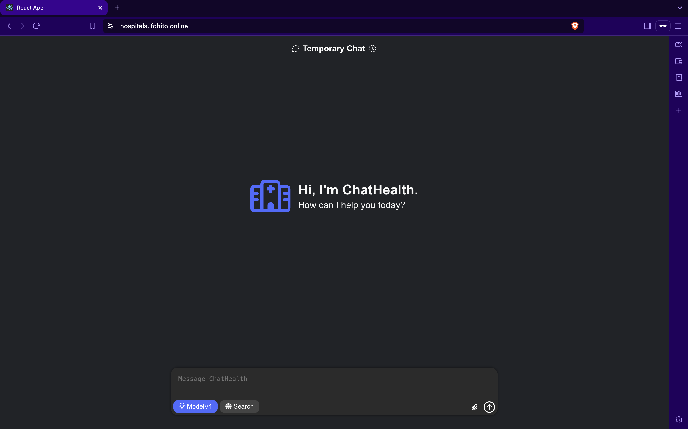
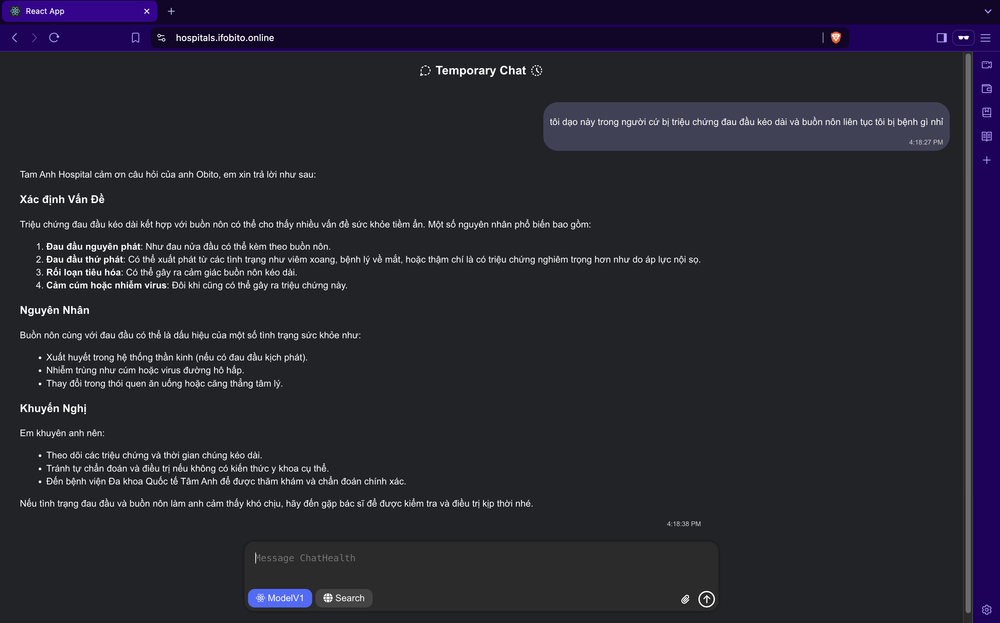
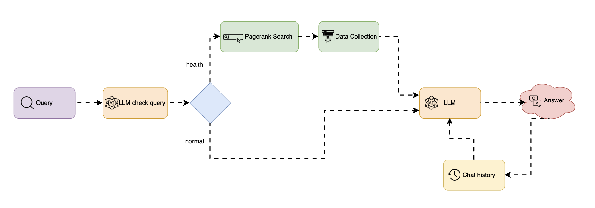

# 🏥 ChatHealth - AI-Powered Healthcare Chatbot


## 📋 Overview

ChatHealth is an AI-powered healthcare chatbot platform designed to provide users with reliable medical information sourced from Tam Anh Hospital's knowledge base. The chatbot assists users with health-related questions, symptoms, treatments, and medical advice, connecting them to appropriate healthcare resources when needed.

**Live Demo:** [hospitals.ifobito.online](https://hospitals.ifobito.online)




## 🌟 Features

- **AI-Powered Medical Responses**: Utilizes advanced language models (Google Gemini and Llama) to provide accurate health information
- **Knowledge Base Integration**: Scrapes and processes medical information from Tam Anh Hospital's website
- **Persistent Chat History**: Maintains conversation context using Redis
- **Responsive UI**: Smooth, mobile-friendly interface with real-time streaming responses
- **Medical Query Classification**: Intelligently classifies whether queries are health-related
- **Markdown Formatting**: Renders responses with proper formatting for readability

## 🔧 Technology Stack

### Backend
- **Framework**: FastAPI
- **Language Models**: 
  - Google Gemini 2.5 Pro (primary response model)
  - Llama 3.3 70B (classification model)
- **Knowledge Retrieval**: 
  - Web scraping with BeautifulSoup
  - Google Search API integration
- **Memory Store**: Redis for chat history
- **Environment**: Python 3.9

### Frontend
- **Framework**: React 19
- **UI Components**: 
  - React Bootstrap
  - FontAwesome icons
- **Markdown Processing**: 
  - React Markdown
  - Remark GFM
  - React Syntax Highlighter

### Infrastructure
- **Containerization**: Docker & Docker Compose
- **Deployment**: Cloudflare Tunnel
- **Log Monitoring**: Dozzle

## 🏗️ System Architecture



The system follows a microservices architecture with the following components:

1. **React Frontend**: User interface for chat interactions
2. **FastAPI Backend**: 
   - Processes user queries
   - Classifies health-related questions
   - Retrieves relevant medical information
   - Generates AI responses
3. **Redis Database**: Stores chat history and context
4. **Cloudflare Tunnel**: Secures communication and enables public access
5. **External Services**:
   - Google Gemini API
   - Groq API (Llama model)
   - Web scraping of Tam Anh Hospital resources

## 🚀 Setup and Installation

### Prerequisites
- Docker and Docker Compose
- Cloudflare account (for Tunnel configuration)
- API keys for:
  - Google Gemini
  - Groq (Llama)

### Environment Setup

1. Clone the repository:
```bash
git clone https://github.com/ifobito/Chatbot-Health.git
cd Chatbot-Health
```

2. Create a `.env` file with the following variables:
```
OPENAI_API_KEY=your_openai_api_key
GENAI_API_KEY=your_google_gemini_api_key
GROQ_API_KEY=your_groq_api_key
REDIS_URL=redis://redis:6379
CLOUDFLARE_TOKEN=your_cloudflare_tunnel_token
```

### Running with Docker Compose

```bash
docker compose up -d
```

This will start:
- Backend service (port 8001)
- Frontend service (port 3001)
- Redis database
- Cloudflare Tunnel
- Dozzle log viewer (port 9999)

## 🔍 Usage

1. Access the frontend at `http://localhost:3001` or via the Cloudflare Tunnel URL
2. Type a health-related question in the chat interface
3. Receive an AI-generated response based on medical information

### Example Questions
- "What are the symptoms of pneumonia?"
- "How to treat a fever at home?"
- "When should I see a doctor for back pain?"

## 📚 Project Structure

```
.
├── backend/                 # Python FastAPI backend
│   ├── app.py               # Main application code
│   ├── Dockerfile           # Backend container definition
│   └── requirements.txt     # Python dependencies
├── frontend/                # React frontend
│   ├── public/              # Static assets
│   ├── src/                 # React source files
│   │   ├── components/      # UI components
│   │   └── App.js           # Main React application
│   ├── Dockerfile           # Frontend container definition
│   └── package.json         # Node.js dependencies
├── cloudflared/             # Cloudflare Tunnel configuration
├── image/                   # README images
├── .env                     # Environment variables
├── docker-compose.yml       # Container orchestration
└── README.md                # This file
```

## ⚙️ Configuration Details

### Cloudflare Tunnel

The application uses Cloudflare Tunnel for secure access. The tunnel routes:
- `backend.ifobito.online` → Backend service
- `hospitals.ifobito.online` → Frontend service

### Redis Configuration

The application uses Redis Stack which includes RedisSearch for enhanced querying capabilities.

## 🛠️ Development

### Backend Development

```bash
cd backend
pip install -r requirements.txt
uvicorn app:app --reload
```

### Frontend Development

```bash
cd frontend
npm install
npm start
```

## 🔒 Security Considerations

- The application uses Cloudflare Tunnel for secure communication
- Environment variables for sensitive API keys
- No personal medical data is stored persistently
- AI responses include disclaimers about consulting healthcare professionals

## 👥 Contributing

1. Fork the repository
2. Create a feature branch: `git checkout -b feature/amazing-feature`
3. Commit your changes: `git commit -m 'Add amazing feature'`
4. Push to the branch: `git push origin feature/amazing-feature`
5. Open a pull request

## 📄 License

This project is licensed under the MIT License - see the LICENSE file for details.

## 📞 Contact

Project Link: [https://github.com/ifobito/Chatbot-Health](https://github.com/ifobito/Chatbot-Health)

## 🙏 Acknowledgements

- [Tam Anh Hospital](https://tamanhhospital.vn) for medical knowledge base
- [Google Gemini](https://gemini.google.com) for AI capabilities
- [Groq](https://groq.com) for Llama model hosting
- [Cloudflare](https://cloudflare.com) for tunnel services